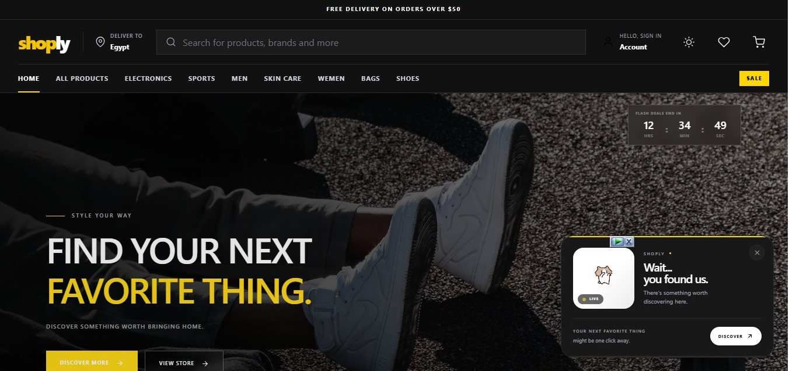
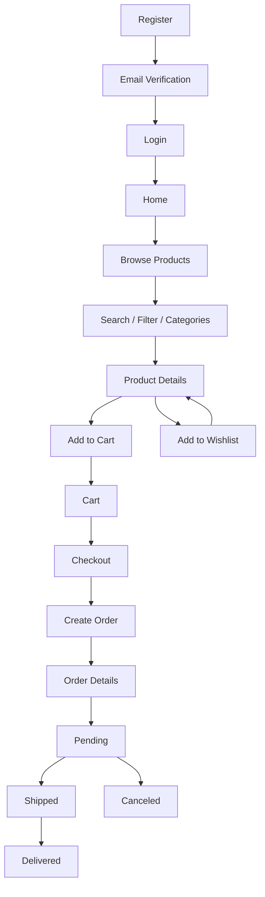
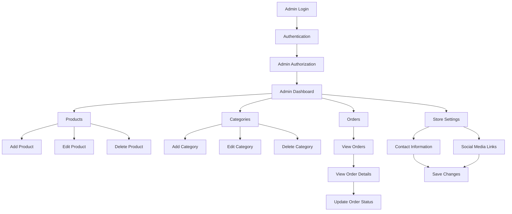
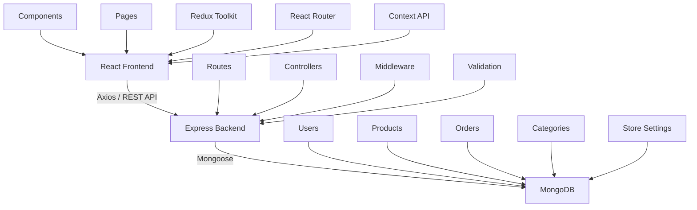
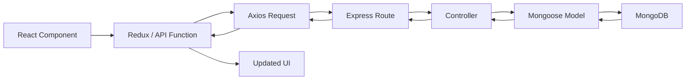
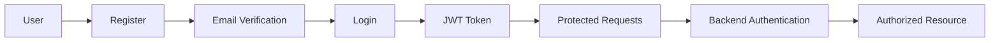

# Shoply — Full-Stack E-Commerce Platform

<p align="center">

  

</p>

<h1 align="center">Shoply</h1>

<p align="center">

  A modern full-stack e-commerce platform built with React.js, Node.js, Express.js, and MongoDB.

</p>

<p align="center">

  <a href="https://deep-dive-final-project.vercel.app/">Live Demo</a>
  <a href="https://youtu.be/vVju0Pc2eEc">Project Demo</a>
  <a href="https://github.com/Neh2l/DeepDive-FinalProject">Source Code</a>

</p>

---

## Overview

Shoply is a full-stack e-commerce platform designed to provide a complete online shopping experience with a modern, responsive, and user-friendly interface.

The project includes a React-based frontend connected to a RESTful Node.js and Express.js backend with MongoDB as the database.

The platform supports both customer and admin workflows, including authentication, product browsing, search, filtering, cart management, wishlist management, checkout, order tracking, product management, category management, order management, and store settings.

---

## Project Demo

### Quick Demo

[](https://youtu.be/vVju0Pc2eEc)

The project demo demonstrates the main customer shopping experience and the admin dashboard features.

---

# Customer Features

## Authentication

- User registration

- Email verification

- User login

- Protected routes

- JWT-based authentication

- Authentication state management

- Logout functionality

## Product Discovery

- Browse products

- View product details

- Search products

- Filter products

- Browse products by category

- Product images

- Product descriptions

- Product prices

- Product stock information

- Product ratings

## Shopping Cart

- Add products to cart

- Remove products from cart

- Increase product quantity

- Decrease product quantity

- Calculate subtotal

- Calculate total price

- View cart items

## Wishlist

- Add products to wishlist

- Remove products from wishlist

- View wishlist

- Move between wishlist and product browsing

## Checkout

- Review cart items

- Review order information

- Create orders

- Confirm order

- Redirect to order details

## Orders

- View user orders

- View order details

- Track order status

- Order statuses:

  - Pending

  - Shipped

  - Delivered

  - Canceled

## User Interface

- Responsive design

- Mobile-friendly navigation

- Desktop layout

- Dark mode

- Light mode

- Smooth animations

- Interactive product cards

- Swiper sliders

- Responsive forms

- Modern e-commerce layout

---

# Admin Dashboard

The admin dashboard provides authorized administrators with tools to manage the store.

## Product Management

Admins can:

- View products

- Add new products

- Edit products

- Delete products

- Upload product images

- Update product information

- Update product prices

- Update product stock

- Assign products to categories

## Category Management

Admins can:

- View categories

- Add categories

- Edit categories

- Delete categories

## Order Management

Admins can:

- View customer orders

- View order details

- Update order status

- Manage order lifecycle

Available order statuses:

- Pending

- Shipped

- Delivered

- Canceled

## Store Settings

Admins can manage:

- Contact information

- Store information

- Social media links

- Footer settings

---

# Application Flow

## Customer Flow



---

## Admin Flow



---

# System Architecture



---

# Data Flow



---

# Authentication and Authorization

Shoply uses JWT-based authentication to secure user accounts and protected resources.

## Authentication Flow



## Authorization

The backend verifies the authenticated user's identity and role before allowing access to protected admin functionality.

Admin-only operations include:

- Product management

- Category management

- Order management

- Store settings management

---

# Tech Stack

## Frontend

| Technology | Purpose |
|---|---|
| React.js | User interface |
| Vite | Development and build tool |
| Tailwind CSS | Styling |
| Redux Toolkit | Global state management |
| React Router | Routing |
| Axios | API communication |
| React Icons | Icons |
| Swiper | Sliders and carousels |

## Backend

| Technology | Purpose |
|---|---|
| Node.js | Backend runtime |
| Express.js | REST API framework |
| MongoDB | Database |
| Mongoose | MongoDB object modeling |
| JWT | Authentication |
| REST API | Frontend-backend communication |

## Development Tools

| Tool | Purpose |
|---|---|
| VS Code | Development environment |
| Git | Version control |
| GitHub | Source control and collaboration |
| Postman | API testing |
| Vercel | Deployment |
| GitHub Actions | Continuous integration |

---

# API Structure

The backend provides RESTful API endpoints for the main application resources.

| Endpoint | Purpose |
|---|---|
| `/api/auth` | Authentication and user accounts |
| `/api/products` | Product management |
| `/api/categories` | Category management |
| `/api/orders` | Order management |
| `/api/wishlist` | Wishlist management |
| `/api/footer-settings` | Store footer settings |

---

# Responsive Design

Shoply is designed to work across different screen sizes.

The interface supports:

- Desktop

- Laptop

- Tablet

- Mobile

Responsive behavior includes:

- Mobile navigation

- Responsive product grids

- Flexible layouts

- Responsive forms

- Responsive admin dashboard

- Mobile-friendly checkout

- Responsive product details

---

# UI/UX

The interface focuses on a clean and modern e-commerce experience.

Main UI/UX principles include:

- Clear visual hierarchy

- Consistent spacing

- Responsive layouts

- Simple navigation

- Accessible interaction patterns

- Clear product information

- Smooth transitions

- Interactive feedback

- Dark and light themes

- Modern e-commerce visual design

---

# Project Structure

```text
DeepDive-FinalProject

│

├── E-commerce

│   ├── src

│   │   ├── components

│   │   ├── pages

│   │   ├── redux

│   │   ├── Apis

│   │   ├── context

│   │   ├── assets

│   │   └── ...

│   │

│   └── package.json

│

├── finalProject_Team5

│   ├── src

│   │   ├── controllers

│   │   ├── models

│   │   ├── routes

│   │   ├── middleware

│   │   ├── validations

│   │   └── ...

│   │

│   └── package.json

│

├── cover

│   └── cover.jpeg

│

└── README.md
```

---

# Getting Started

## Clone the Repository

```bash
git clone https://github.com/Neh2l/DeepDive-FinalProject.git
```

```bash
cd DeepDive-FinalProject
```

---

## Frontend Setup

```bash
cd E-commerce
```

```bash
npm install
```

Run the frontend development server:

```bash
npm run dev
```

The frontend will run using Vite.

---

## Backend Setup

Open another terminal and navigate to the backend:

```bash
cd DeepDive-FinalProject
```

```bash
cd finalProject_Team5
```

Install dependencies:

```bash
npm install
```

Run the backend:

```bash
npm run run:dev
```

---

# Team

## Frontend Developer

### Nehal Reda Mohamed

Frontend development and UI implementation.

GitHub:

https://github.com/Neh2l

---

## Backend Team

### Aya Ahmed

Backend development.

GitHub:

https://github.com/ayaa7med2006

### Mohamed Gaber

Backend development.

GitHub:

https://github.com/mohamed-gaber1

### Aya Gamal

Backend development.

GitHub:

https://github.com/ayagamal11x

---

# License

This project was developed for educational and development purposes.

